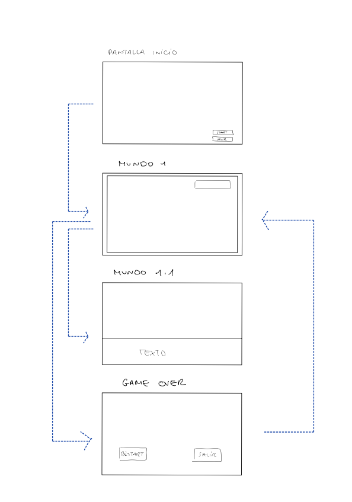
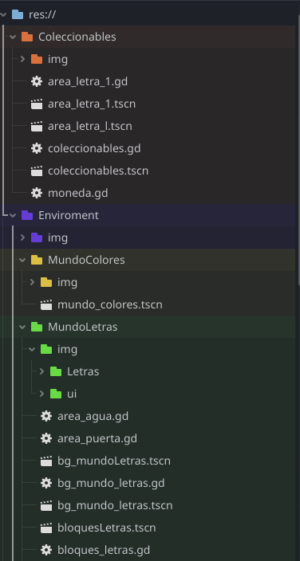
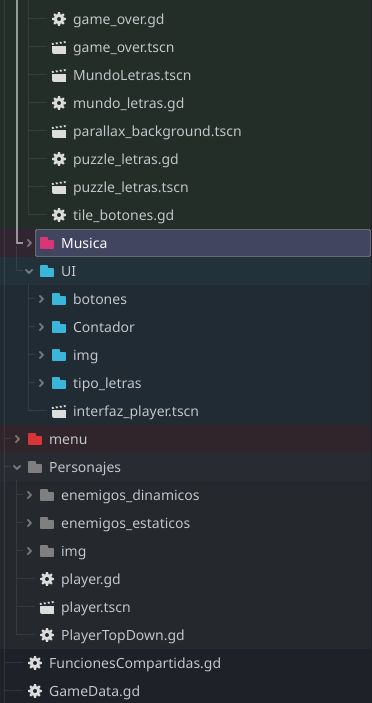

# Buddy y el Libro Mágico

### https://github.com/Saykek/BuddyYElLibroMagico.git

## Índice

1. [Conceptualización](#1-conceptualización)
   - [Título del juego](#título-del-juego)
   - [Historia](#historia)
   - [Objetivo del juego](#objetivo-del-juego)
   - [Mundos del juego](#mundos-del-juego)
     - [Mundo de las Letras](#mundo-de-las-letras)
     - [Mundo de los Colores](#mundo-de-los-colores)
     - [Mundo de los Números](#mundo-de-los-números)
     - [Mundo de la Geometría](#mundo-de-la-geometría)
     - [Mundo de los Animales](#mundo-de-los-animales)
     - [Mundo de la Ciencia](#mundo-de-la-ciencia)
     - [Mundo de las Estaciones](#mundo-de-las-estaciones)
     - [Mundo de la Historia](#mundo-de-la-historia)
   - [Story Boards](#story-boards)

2. [Arte](#2-arte)

3. [Programación](#3-programación)
   - [Flujo del juego](#flujo-del-juego)  
   - [Estructura del código](#estructura-del-código)  
   - [Personaje principal](#personaje-principal)
   - [Enemigos](#enemigos)
   - [Interfaces de usuario](#interfaces-de-usuario)
   - [Items](#items)
   - [Señales y Grupos](#señales-y-grupos)
   - [Arquitectura del juego](#arquitectura-del-juego)
   - [Creación de mundos](#creación-de-mundos)
   - [Parallax](#parallax)
   - [Ajustes de cámara](#ajustes-de-cámara)
   - [Tilemap y TilemapLayer](#tilemap-y-tilemaplayer)
   - [Sprites](#sprites)

4. [Distribución y Publicación](#4-distribución-y-publicación)

5. [Elementos destacables del desarrollo](#5-elementos-destacables-del-desarrollo)
   - [Innovaciones](#innovaciones)
   - [Problemas](#problemas)

6. [Elementos a comprobar en el videojuego](#6-elementos-a-comprobar-en-el-videojuego)

# Buddy Y El Libro Mágico

## 1. CONCEPTUALIZACIÓN

#### Título del juego : Buddy y el libro mágico

Empecé pensando una historia a la que fui dando vueltas, tenía varias ideas: debía ser un videojuego de plataformas, pero me gustaba la idea que fuera tipo puzzle, entonces he intentado integrar ambas (investigando un poco como son la creación de juegos top-down). Al final el ámbito personal me hizo por decantarme por un juego para niños (que mejor que mis hijos para ser críticos con el juego). Dándole vueltas a la idea se me ocurrió que a parte de entretener podría ser educativo. 

El personaje principal surgió de la propia historia y, por eso, es un niño.

El niño se llama Buddy (ya que una de nuestras mascotas se llama así), es un niño alegre, aventurero pero sobre todo muy curioso,y ¿por qué no adentrarnos en un mundo mágico? a esas edades la mágia todavía es algo real, algo que les apasiona.

#### Historia:

Buddy era un niño muy curioso. Un día, mientras exploraba el desván de su casa, encontró un libro antiguo cubierto de polvo. Este libro no era como los demás. Tenía una cubierta brillante con extraños símbolos y una textura suave al tacto. Intrigado, Buddy comenzó a hojearlo y, de repente, una luz cegadora lo envolvió.

Al abrir los ojos, Buddy ya no era el mismo niño. ¡Se había transformado en un guerrero! El libro lo había transportado a un mundo lleno de magia y conocimiento. En este lugar, el mundo de las letras, los números, los colores, y muchos otros conceptos formaban un único universo interconectado. 

Pero algo extraño ocurrió: el libro, que parecía tener todas las respuestas para volver a casa, perdió sus páginas para poder regresar. Sin ellas, Buddy no podrá regresar a su hogar.

La misión de Buddy será aventurarse en estos mundos, recolectar las páginas del libro perdido y superar los desafíos de cada uno. Cada página tiene la clave para regresar a su casa con sus padres. Además, el libro, al estar incompleto, le proporciona pistas parciales, pero para descubrir cómo regresar completamente, Buddy deberá resolver acertijos, hacer operaciones y explorar los secretos del conocimiento. 

Mientras avanza, el libro se llena poco a poco, y Buddy descubre más sobre él mismo y sobre el mundo en el que está atrapado. Solo cuando haya recogido todas las páginas y completado el conocimiento de los diferentes mundos, Buddy podrá abrir el último portal y regresar a su vida normal. 

####  Objetivo del juego:

El objetivo del juego sera pasar por cada uno de los mundos y conseguir completarlos, para ello deberá ir recogiendo los diferentes items que se vaya encontrando por el camino. En cada mundo completado se recibirá una página perdida del libro, la cual será un paso más para poder regresar a su hogar.

#### Mundos del juego:

Todos los mundos contarían con 10 niveles, según vayan avanzando será más difícil superarlos. Pongo algunos ejemplos de cada mundo, pero cada nivel tendría algo especial.
Durante la aventura podrán recoger objetos especiales que tendrán siempre disponibles, como una calculadora ( para el mundo de los números, un mapa con diferentes épocas de la historia( mundo de la historia), un pergamino con un cuerpo humano y sus partes(mundo de la ciencia))... También recogerán tarjetas didácticas que podrán acceder a ellas a través de su inventario cuando lo necesiten o crean oportuno, en muchas de ellas podrá contener "pistas" para pasar algunos niveles.
Para motivar al jugador recibirán recompensas a lo largo del juego, los mundos tendrán colores llamativos y una música para cada ocasión.

**1. Mundo de las Letras:** 

**Recoger letras:** Buddy deberá moverse por la pantalla para poder recolectar todas las letras que haya, estas se irán guardando, y cuando haya conseguido todas se activara una puerta que le llevara a otra pantalla. 
**Ordenar las letras**: Se presentan letras según las haya ido recogiendo Buddy, deberán ser ordenadas en el orden correcto para poder pasar al siguiente nivel.
Para ordenarlas hay un acertijo que dará una pista, ya que la solución es la palabra a descifrar.

La idea es que este mundo contase con 10 niveles, en cada nivel recoger unas letras diferentes con diversos acertijos, subiendo de dificultad según se avance, en los últimos se irán recogiendo letras de sobra en niveles inferiores para usar más adelante, asi no tendrían las letras exactas de la palabra y aumentaría su dificultad.

**2. Mundo de los Colores:**

**Recoger objetos de colores:** Buddy se introduce en un mundo lleno de colores donde tiene que recoger objetos diferentes para completar el nivel.
En el primer nivel, deberá recoger diferentes frutas y una vez cogidas todas se abrirá una puerta para llegar a una pantalla donde, esas frutas recogidas deberán ser depositadas en el contenedor de su color, para así poder pasar al siguiente nivel. 
Habría niveles de más dificultad entre los cuales estaría este juego:
**Juego de mezclar colores:** Buddy deberá aprender a mezclar colores juntando objetos de diferentes colores y formar nuevos.

**3. Mundo de los Números:** 

**Suma y Resta:** Buddy debe recoger monedas para poder resolver las operaciones matemáticas como parte de las misiones. 
**Desafíos numéricos:** Buddy encontrará cajas o puertas bloqueadas que solo se abren si resuelven operaciones matemáticas. Buddy podrá seleccionar las respuestas correctas entre varias opciones. 
**"La torre matemática":** Buddy tendrá que subir una torre resolviendo operaciones matemáticas en cada nivel. Al final de la torre, se enfrentará a Sumotron, el "jefe" que le hace preguntas difíciles. 

**4. Mundo de la Geometría:** 

**Formas y figuras:** Buddy tendrá que recoger diferentes formas geométricas (círculos, cuadrados, triángulos), cuando las tenga todas irá a otra pantalla (top-down) y tendrá que organizarlas o combinarlas para completar una figura.
En niveles más avanzados: 
**Construir estructuras:** Deberá construir estructuras utilizando figuras geométricas básicas(formar un puente con triángulos o construir una casa con rectángulos) para poder pasarse el nivel.

**5. Mundo de los Animales:** 

**Reconocimiento de animales:** Buddy tendrá que encontrar animales y aprender su nombre, qué comen, etc. para ello, al recolectar el animal recibirá una carta con la información que podrá consultarla cuando lo necesite.
En niveles más avanzados:
**Juegos de asociación:** Buddy deberá escuchar los sonidos de animales y encontrar el animal al que pertenece. 

**6. Mundo de la Ciencia:** 

**Explorando el cuerpo humano:** Buddy deberá resolver acertijos sobre el cuerpo. 
**Experimentos simples:** Buddy tendrá la oportunidad de jugar a mini-juegos que simulan experimentos científicos básicos, como el crecimiento de plantas o la formación de nubes... 
**Sin gravedad:** Buddy podrá perder la gravedad y experimentar lo que sucede.

**7. Mundo de las Estaciones:** 

**Estaciones del año:** Buddy podrá aprender sobre las estaciones del año (primavera, verano, otoño, invierno). El juego cambiará de estación a medida que avanza, y Buddy deberá adaptarse a los cambios de clima y actividades relacionadas con cada estación. 
**Ropa para cada estación:** Buddy deberá a través de mini-juegos elegir la ropa adecuada para cada estación del año.
**Hielo** Habrá pantallas de hielo que modificando la fricción el personaje simulará que resbala.

**8. Mundo de la Historia:** 

**Viaje en el tiempo:** Buddy podrá viajar a diferentes épocas de la historia, como la Edad Media, la Edad de Piedra o la Antigua Grecia, y aprender sobre eventos importantes y personajes históricos. 
**Construir civilizaciones:** Buddy a través de mini-juegos podrá aprender sobre civilizaciones antiguas al construir sus propias ciudades, templos, pirámides, etc., mientras resuelve acertijos y tareas. 

#### Story Boards

Aquí se describe la historia muy resumida.

## 2. ARTE

El estilo gráfico del juego será colorido y atractivo para niños de 6-10 años. Cada mundo tendrá su propio estilo visual y sus propios personajes o elementos relacionados con su temática: 

**Letras**: Letras flotantes, libros, alfabetos en diferentes formas y colores. 
**Números:** Planteamiento de operaciones matemáticas como plataformas o puzzles visuales. 
**Colores:** Elementos que reaccionan a la mezcla de colores (por ejemplo, líquidos de diferentes colores o pinturas). 
**Geometría:** Formas geométricas flotando, plataformas que encajan solo cuando se resuelven los acertijos. 
**Animales:** Animalitos en paisajes naturales, con sonidos de animales que ayudan en el progreso del juego.  
**Ciencia:** Elementos del cuerpo humano,elementos científicos,microscopios, y planetas. 
**Estaciones:** Paisajes que cambian de acuerdo con la estación del año: invierno, primavera, verano, otoño. 
**Historia:** Paisajes históricos con elementos visuales de diferentes épocas. 

 

**Aquí muestro un ejemplo de organización**

MundoLetras
│
├── fondo                         **Nodo de fondo**
│
├── Player                       **Nodo del jugador**
│
├── TileMapLayer                  **Capa de Tiles del mapa**
│
├── AudioStreamPlayer2D           **Audio**
│
├── Coleccionables (Node2D)      **Nodo que agrupa las áreas de coleccionables**
│   ├── Monedas                  **# **Área para detectar monedas**
│   └── Letras                   **Área para detectar letras**
│
├── Enemigo (Node2D)             **Nodo que agrupa los enemigos**
│   ├── enemigo_oso              **Enemigo tipo Oso**
│   ├── enemigo_pinchos          **Enemigo tipo Pinchos**
│   ├── enemigo_pinchos2         **Enemigo tipo Pinchos 2**
│   ├── enemigo_abeja            **Enemigo tipo Abeja**
│   ├── enemigo_camaleón         **Enemigo tipo Camaleón**
│   └── ana_seta                 **Enemigo tipo Seta**
│
├── ParallaxBackground           **Fondo en parallax**
│
└── Audio_agua                   **Audio de cuando cae en el agua**

## 3. PROGRAMACIÓN

**Flujo del juego**

 

Se empieza jugando en el menú principal donde podremos elegir salir o comenzar a jugar. 
Entraríamos en la pantalla del primer mundo, ahi podríamos pasarnos la pantalla(donde pasaríamos a la siguiente) o nos podrían matar los enemigos, entonces pasaríamos a la pantalla de Game Over, y desde esta podremos elegir si empezar en la primera pantalla o salir del juego. Este flujo es así porque no tenemos prácticamente pantallas, pero la idea es que se vaya guardando según vayamos avanzando. En las pantallas largas habrá también marcadores de guardado.

En la programación de Buddy y el Libro Mágico me he ceñido un poco al tiempo que hemos tenido y a lo visto en clase, aunque he incluido nuevas funcionalidades.
El código implementa el comportamiento básico del jugador en el juego, que incluye movimientos, interacciones con objetos (como recoger monedas y letras), gestión de la vida (cuando el jugador cae al agua o recibe daño) y el control de las animaciones del personaje

**Estructura código**

Esta estructurado en carpetas y por colores para una mejor gestión. Dentro de Res tenemos la carpeta de coleccionables( donde guardaremos los items que vaya recogiendo),enviroment(tenemos todo lo relacionado con las escenas que a su vez esta separado por mundos,música, interfaz de usuario ), menú(tiene todo lo relacionado con el menú principal) y personajes( donde tenemos a los personajes, donde los enemigos están separados por estáticos o dinámicos), y a parte,  tenemos dos scripts que serían utilizables para todo el juego y el readme.

**PERSONAJE PRINCIPAL**

**Interacción del jugador:**
 Los jugadores podrán mover a Buddy por los escenarios, recoger objetos, resolver acertijos y avanzar en la historia. 
El jugador puede moverse horizontalmente a través de la escena, con una aceleración que varía dependiendo de si está en el aire o en el suelo. El control se realiza mediante las teclas de dirección ( <- ->), y el personaje se mueve más rápido cuando está en el suelo, mientras que el movimiento en el aire es más fluido y limitado. Para saltar se hará con la tecla "Space", he implementado una física de gravedad para hacerlo más realista, cada vez que el jugador salta hará un sonido.

**Vida y Muerte:**
El jugador tiene un sistema de vida basado en la variable vida. Si la vida llega a cero,el jugador irá perdiendo vidas si recibe daño del enemigo o cae al vacío, hará un sonido cada vez que sufra daño,al perder todas las vida que tenga el jugador muere, suena otro sonido diferente y la escena se reinicia.

**Recoger Ítems:**
El jugador puede recoger ítems como monedas, letras, corazones... Cada vez que se recoge un ítem, se incrementa el contador correspondiente y se reproduce un sonido de recolección(cada item tiene su propio sonido).

**Estructura del código:**
El código está dividido en varias funciones que gestionan diferentes aspectos del comportamiento del jugador. La función _ready() inicializa los contadores de vida, monedas y letras. Las funciones de movimiento, salto, y ataque se gestionan dentro del ciclo de physics_process(), donde se aplica la física del juego y se controlan las animaciones del personaje. Además, el sistema de daño y la recolección de ítems están implementados mediante funciones específicas como perder_vida(), caida_vacio, add_monedas y add_monedas().

**Flujo:**
El flujo se maneja a través de comprobar constantemente si el jugador esta tocando el suelo o en el aire, si esta tocando un enemigo ( ya sea dinámico o estático), si ha recogido un items, la animación y el sonido.

**ENEMIGOS**
El código de los enemigos gestiona su comportamiento, incluyendo su movimiento, interacción con el jugador y la gestión de colisiones. Hay enemigos que siguen una lógica básica de movimiento horizontal y otros de movimiento vertical detectando los bordes y cambiando de dirección al chocarse contra paredes, o simplemente entre unas coordenadas.

**Movimiento y Detección de Paredes**
El enemigo se mueve de izquierda a derecha o bien entre unas coordenadas o en toda la plataforma mediante dos detectores. Estos detectores permiten saber si el enemigo ha llegado a un borde o pared, y algunos de ellos lo usan también para detectar al personajes principal.
Si el detector izquierdo (det_izquierdo) detecta una pared, el enemigo cambia de dirección hacia la derecha.
Si el detector derecho (det_derecho) detecta una pared, el enemigo cambia de dirección hacia la izquierda.
Este movimiento es controlado por la variable sentido, que determina en qué dirección se mueve el enemigo, y la velocidad de movimiento está controlada por la constante VELOCIDAD. La animación del enemigo también se invierte dependiendo de la dirección en la que se mueva (utilizando ani_seta.flip_h).

**Gravedad y Física:**
El enemigo se ve afectado por la gravedad del juego, al igual que el personaje principal.

**Interacción con el Jugador:**
Cuando el enemigo entra en contacto con el jugador, se activa la función _on_area_seta_body_entered(). En esta función, si el enemigo colisiona con el jugador (detectado mediante body.is_in_group("jugador")), el jugador pierde vida mediante el método perder_vida(position.x). El jugador también será desplazado hacia la izquierda o derecha dependiendo de por donde reciba el golpe.

**Flujo de Control:**
El código de los enemigos está organizado dentro de la función _physics_process(). En este ciclo, se calcula la gravedad, se detectan las colisiones con las paredes y se mueve al enemigo de acuerdo con su dirección. El cambio de dirección del enemigo se produce cuando se detecta una pared en su camino, lo que provoca que el enemigo invierta su dirección y continúe.

**Animaciones:**
Hay enemigos que tienen animaciones( que cambian al moverse izquierda o derecha), y otros no. 

**INTERFACES DE USUARIO**

**Menús (Inicio y GameOver):**
Este código gestiona las interacciones con los botones de la interfaz de usuario, permitiendo que el jugador inicie el juego o salga del mismo mediante acciones en la pantalla principal o menú de inicio, y en la pantalla de game over podrá reiniciar partida o salir.

**ITEMS**

Los items tienen una programación muy sencilla , la función de que si el personaje entra en contacto con el item llamará a otras funciones como (add_monedas(), add_letras()...). 
Para mostrar los items hay un script llamado contador, que los  mostrará en un label.

**SEÑALES Y GRUPOS**

En el código hago uso de las señales. Se utilizan como eventos para la interacción entre nodos.Por ejemplo, cuando el jugador entra en contacto con un enemigo se manda una señal que invoca la función de perder_vida()... Utilizo las señales junto a los grupos, así si una señal entra en contacto con un grupo determinado puedo programar fácilmente los enemigos.
También utilizo las señales en la interfaz de usuario, en los botones, para saber si es presionado o no.

Los grupos se utilizan para identificar y organizar grupos, como su propio nombre indica. Es muy util crear un grupo de jugadores, enemigos...

**ARQUITECTURA DEL JUEGO**

Empecé a organizar todo en nodos creyendo que iba a estar más organizado pero me suponía muchos problemas a la hora de programar. Según se fueron subiendo los apuntes vi que todo se hacía más sencillo, entonces lo mismo hay un poco caos en ese aspecto. 
***Nodos:***
****CharacterBody2D:**** Usado para el jugador y enemigos, controlando la física y movimiento en el juego.
****Area2D:**** Utilizado para detectar colisiones, como las áreas de los enemigos para interactuar con el jugador, puertas...
****Control:**** Usado en la UI para mostrar las estadísticas del jugador, como el número de vidas, monedas y letras.
****Señales:**** Permiten la comunicación entre nodos. Los uso para gestionar eventos de interacción (como botones, colisiones, etc.).
****Grupos:**** Para clasificar nodos de forma eficiente, como los grupos "jugador" y "enemigos", lo que facilita la identificación y manipulación.

**CREACIÓN DE MUNDOS**
Los mundos en el juego están formados por escenas que incluyen múltiples elementos, como el terreno, objetos interactivos, enemigos y el jugador. Estos mundos se construyen utilizando nodos
como tilemaplayer, parallaxLayer, Node2d ...En ellos incluyo todas las escenas creadas individualmente de enemigos, jugador, items...

**PARALLAX**
Creado con parallaxLayer donde incluyo diferentes fondos , los cuales programados a diferente velocidad crean una sensación de profundidad y movimiento.

**AJUSTES DE CÁMARA**
La cámara esta ajustada a los limites de la pantalla, para que cuando se mueva el jugador ( el que lleva la cámara) no salga de los limites de la pantalla y se vea vacía la escena.

**TILEMAP Y TILEMAPLAYER**
Los he utilizado para crear las escenas por donde se moverá el jugador, se base en tiles que son mosaicos, las cuales se pueden editar, y muchas de ellas llevan la colisión ya.

**SPRITES**
He utilizado sprites para meter imágenes, tanto al jugador, los items, enemigos.. si van dentro de un AnimationPlayer se les puede dar movimiento. He utilizado tanto sprite en frames como en una hoja de sprites.

## 4.Distribución y Publicación: 

Una vez que el juego esté listo, se podrá distribuir a través de varias plataformas.Algunas opciones incluyen: 

Plataformas móviles (Android / iOS) y PC / Mac. 

El lanzamiento ira acompañado de material de marketing enfocado a padres y educadores, destacando los aspectos educativos del juego. Además, se incluiría elementos como logros o recompensas dentro del juego para mantener la motivación de los niños.El juego podría ser gratuito con compras internas de nuevos personajes, items, mundos extras...

## 5.Elementos destacables del desarrollo: 
 
**INNOVACIONES**
- He puesto sonidos en diferentes acciones , como en saltar, cuando te quitan una vida, otro para cuando pierdes todas, cada item tiene también un sonido diferente... 
- He creado un enemigo que está escondido y solo sale cuando estás cerca a una cierta distancia, está en reposo, después anda y por último ataca. 
- Cuando un enemigo te colisiona, te quita una vida y el personaje hace un efecto rebote hacia atrás teniendo en cuenta por el lado que colisionas. 
- En el menú he puesto las carpetas organizadas por colores para una mejor organización .
- He creado enemigos que se mueven entre unas coordenadas. 
- Pantalla de GameOver desde la que reiniciar el juego o salir. 
- Para el escalado de pantalla cambie la configuración de proyecto y en la configuración de la ventana lo he cambiado a canvas.item, sino al redimensionar la pantalla de inicio por ejemplo los botones, el fondo.. todo quedaba mal estructurado. 

**PROBLEMAS**
- Al cambiar los límites de la cámara en la primera pantalla queda bien pero en la demás al no ser del mismo tamaño esos límites no me valen, tendría que sacar la cámara del jugador. 
- Al añadir la música lo hice en la escena final(ya que cada escena llevará su propia música) y al avanzar la música iba bajándose de volumen hasta que desaparecía, la puse centrada y se solucionó, con esto me di cuenta que daría mucho juego para poner varios sonidos en la misma escena(en el mundo de la ciencia quedaría genial). Creo que una posible solución sería hacer una escena donde poner los elementos comunes como cámara , música.... 
- Tenía mi fondo creado pero lo modifiqué (el del primer mundo) para añadirle la sensación de movimiento con “Parallax”, y al poner que sensación repita el fondo el patrón de dibujo que lleva no coincide, es muy poco pero sería una cosa a mirar como modificarlo. 
- He tenido muchos problemas a la hora de programar las vidas del personaje. La primera idea fue que tendría X vidas y cada vez que colisionara con un enemigo perdería 1 vida y se reproduciría la animación de morir y se reiniciaría la escena. Conseguí lo de las vidas, me las restaba pero la imagen no se reproducía y con reiniciar las físicas se reproducía la imagen pero perdía una vida solamente, después de horas dándole vueltas al código y pensando posibles soluciones me di cuenta que tampoco sería muy adecuado que en un juego de niños con un solo toque tuviesen que reiniciar la pantalla, iba a resultar frustrante, así que se me ocurrió que le hiciera daño al tocarle y perdiera vida, pero solo reiniciaría si perdía todas. Ahí me di cuenta que tenía que meter algo porque al acercarme me quitaba las vidas seguidas, y metí un efecto rebote(que ya he explicado en innovaciones). En vez de reiniciar va a la pantalla de GameOver pero hay un pequeño fallo y es que no se porque no se reproduce la animación de morir y si una vez perdidas todas las vidas te sigue dando(ya que tarda 3 segundos en recargar pantalla) no va hacia la pantalla GameOver, si mueres y no te dan si va. He decidido no “perder” más tiempo con eso y explicártelo aquí . 
- Otro problema es que va perdiendo vidas según los enemigos te van dando, pero si caes al vacío, al reiniciar la pantalla se reinician también las variables. He intentado arreglarlo pero me ha frustrado mucho el tiempo y no he podido, sería una cosa a corregir. He intentado hacer un script GameData para que guarde el valor de las variables siempre pero no me ha dado tiempo a investigar más.
- Le dediqué mucho tiempo a investigar para hacer un salto más realista, que el impulso hacía arriba y la caída fueran diferentes, también la idea era que detectará la pulsación para la longitud del salto ( a más pulsación más altura cogería) pero la falta de tiempo me ha hecho dejarlo a medias. Sería una mejora importante que mirar.

## 5.Elementos a comprobar en el videojuego: 

**He creado varias pantallas:**
 - La primera "Mundo Letras", los elementos destacables son los enemigos(personajes y pinchos y agua) ( programados para quitar vidas).
Los items se pueden recoger.
Al subir a la plataforma de arriba y acercarte a la flecha aparece un enemigo oculto.
Al final de la pantalla, arriba hay una casa y al acercarte a la puerta cambia a la siguiente, faltaría programarla para que hasta que no se cojan las 5 letras no se active.
- La siguiente Puzzle Letras esta a medias, en esta pantalla cambiamos de modo de juego usando "Top-Down", aquí el jugador se moverá sin gravedad, no podrá saltar pero se moverá en las 4 direcciones. La idea es que seleccione las letras tocándolas en el orden adecuado para resolver la adivinanza, faltaría una palanca que confirme cuando tenga todas las letras ordenadas y si es correcto pase a la siguiente.
- He creado una pantalla del segundo mundo(pero esta no esta conectada), "Mundo Colores", se ve como va a ser de colores vivos, faltaría añadir muchos items, y la puerta de entrada a la siguiente seria el "agujero negro" que hay una vez realizada la misión se activaría.
- Comprobar que entra a la pantalla de Game Over, tiene que ser con 4 golpes de enemigos, ya que tiene 3 vidas pero he hecho que la última sea la cero.